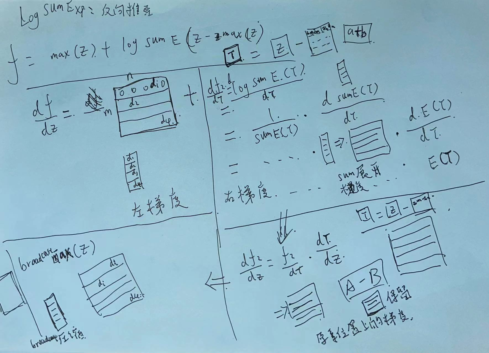

LogSumExp 计算梯度的一些思路

  由于问题等价，所以反向的梯度能不能直接用变型前的公式求？？
  * 答：不行，因为计算反向梯度时，调用的中间值也会存在数值溢出问题

### 三种尝试
* [X] [有点小问题]尝试一：使用自己推导的梯度公式
  * 需要实现max算子，目前计算numpy mask计算效率不高。
* [ ] [看不懂，不看了]尝试二：理解bfsh的那一行代码是什么意思。(不理解)
* [X] 尝试三：needle重构时，把这个算子废除掉，直接用原子op堆出来比较简单。

### 反向梯度求导公式（尝试）
